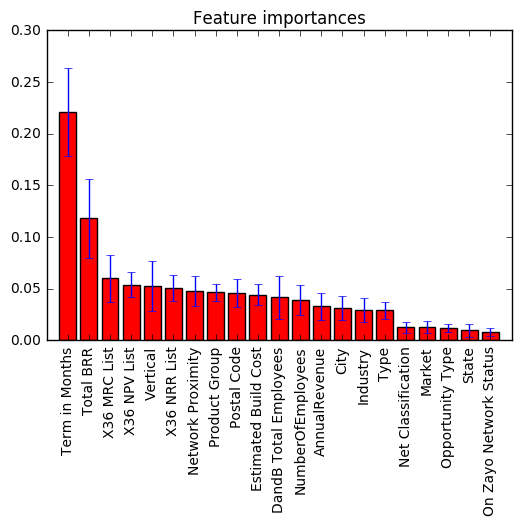
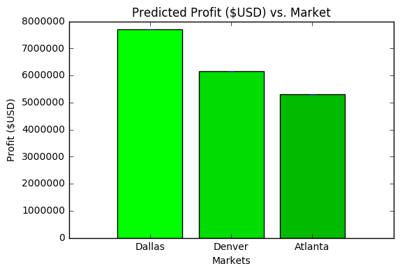
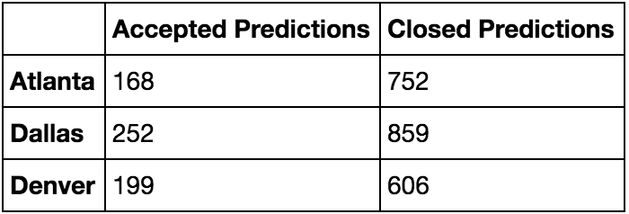
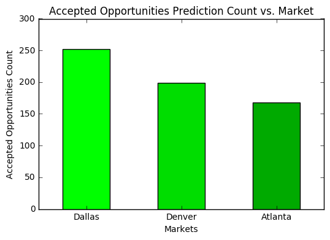
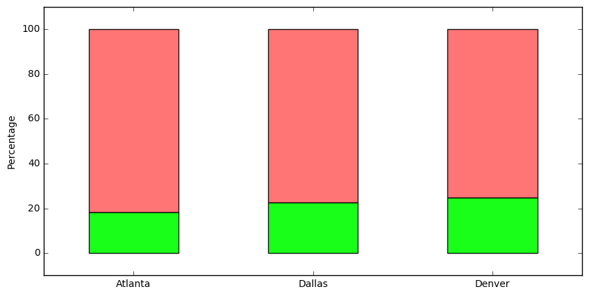

# Zayo Data Analysis - Random Forests Approach

## Summary
A Random Forest machine learning (ML) algorithm was trained on the Zayo dataset with a 80% accuracy in predicting whether an opportunity will lead to an accepted opportunity or not based on the set of opportunity features, such as Industry, Total BRR, X36 MRC/NPV/NRR List, Building Types, Term, etc.

### Most Important Opportunity Features for Prediction
The ML model indicates that **Term in Months** and **Total BRR** as the most important features for predicting an accepted opportunity.

</img>

### Markets to Pursue
Next, the trained random forest model was used to make predictions on the unlabeled data extracted from the Zayo opportunity datasets (Opportunity Stages 1 and 2, explained below). The X36 NPV for each opportunity with an accepted prediction was calculated for each market: Atlanta, Dallas, and Denver. As we can see, Dallas holds the most potential for profits.

</img>

The counts of predicted Accepted vs. Lost opportunities for each market are tabulated below.

</img>

Visually, we can get a sense of the distribution of accepted predictions below. Again, Dallas looks to be the most promising.

</img>

Lastly, the proportion of Accepted vs. Lost predictions for each market was investigated. The proportion of potential profit to gain is greater for Denver than for Dallas, but perhaps not by a signficant amount.

</img>

A risk analysis may reveal whether Dallas or Denver is the best market to invest into, pending the uncertainties of the predictions, etc. Further, additional Zayo data may likely improve the accuracy of the model and lend to more definitive results.

**Dallas** and **Denver** are the two markets that show the most promise, whereas **Atlanta** lags behind on all predictive measures.

## Feature Engineering
The opportunities, cpqs, buildings, and accounts sheets were used to agggregated the data for this analysis; consequently, this resulted in a large number of features that would not be particularly useful for making predictions (e.g. created date and unique identifiers, such as Building ID), as well as a number of features that are highly correlated with one another (e.g., city, lat/lon, street address). The features were surveyed and filtered out of the set.

Following the dropping of features, it was necessary to devise a way to parse the data into a training set for the model and a dataset with no labels; that is, there exists no metric in the data of whether a particular opportunity has been successful (accepted) or unsuccessful (lost). The aggregation into a new feature is explained below.

### Dropped Features
- Opportunity ID
- Account ID
- IsClosed
- IsWon
- CreatedDate
- Building ID
- Street Address
- Longitude
- Latitude
- Service

### Aggregated Feature
The StageName feature was utilized to parse out the training/testing data from the unlabeled data to be used for training and testing the Machine Learning algorithm, followed by utilizing the model to make predictions on the unlabeled data.

The StageName feature is comprised of the following 6 values:

- **Closed - Lost**
  - Training Data - Negative Label

- **1 - Working**
  - Unlabeled Data - Use for Predictions

- **2 - Best Case**
  - Unlabeled Data - Use for Predictions

- **3 - Committed**
  - Training Data - Positive Label

- **4 - Closed**
  - Training Data - Positive Label

- **5 - Accepted**
  - Training Data - Positive Label

## Results
The most important features of an opportunity for predicting it as accepted or lost is the term in months and total BRR. Dallas and Denver are the most promising markets to pursue, with Dallas having a slight advantage in terms of prospective profit. 
:tada:
